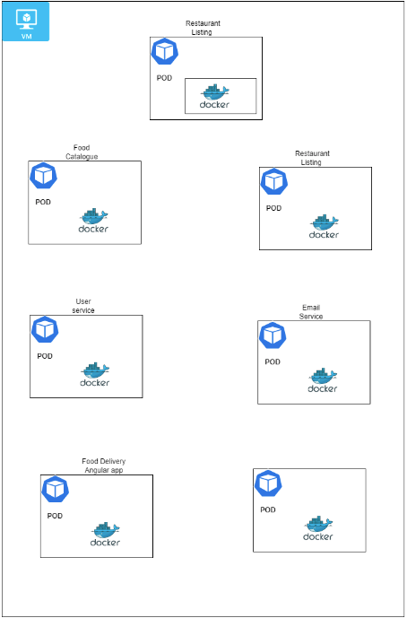
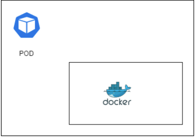
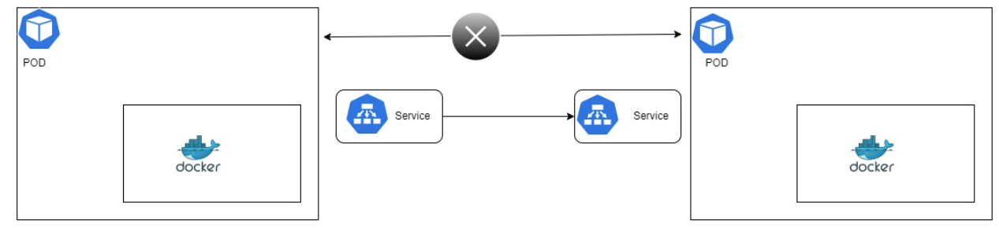
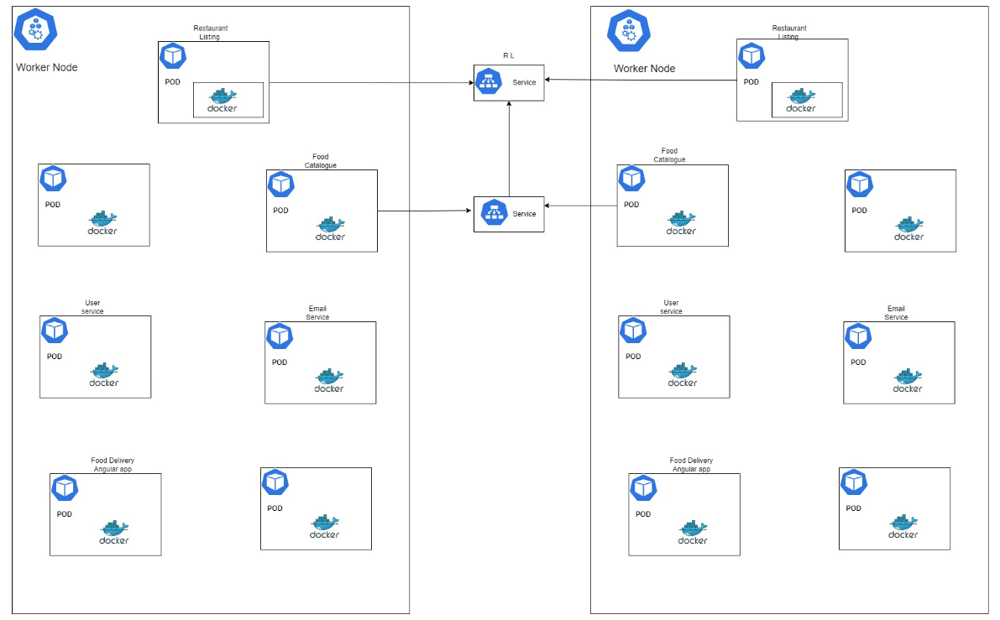

# Kubernetes
___

## What is Kubernetes?

- Kubernetes is an open-source container orchestration platform that automates the deployment, scaling, and management of containerized applications.

- Orchestration involves managing the lifecycle of containers, including their deployment, scaling, networking, storage, and monitoring. Kubernetes acts as the central control plane that automates and coordinates these tasks, ensuring that the desired state of the application or system is maintained.

- Containerization allows applications to be packaged along with their dependencies, such as libraries and configuration files, into lightweight, portable units called containers. Kubernetes provides a framework for managing and running these containers across a cluster of machines.
___
## Why Kubernetes?
- Simplified Deployment

- Automated Scaling and Load Balancing

- Self-Healing and Fault Tolerance

- Rollouts and Rollbacks

- High availability with technically no downtime

- Kubernetes makes it easier to develop, deploy, and manage applications, allowing developers and operations teams to focus more on delivering value and less on infrastructure management.
___
## Components of Kubernetes?
- Node
- Pods 
- Services 
- Ingress 
- Config maps 
- Secrets 
- Volumes 
- Deployments 
- Stateful set
- You need to deploy your app on a physical
  server or a virtual machine (VM) and that machine
  is called  a worker node or simply a "node. Or a slave

___
## What is a POD?
- In Kubernetes (K8s), a pod is the smallest deployable unit and the basic building block of the platform. 
- It represents a group of one or more tightly coupled containers that are scheduled and run together on the same node within a cluster. 
- But in real time scenarios u will see maximum 1 Container running inside each POD 
- Pods are designed to be crashable and disposable 
- Each Pod has its own IP address 
- Each POD can communicate using These IP addresses 
- But if POD crashes then? Will u change mapping Everytime the POD crashes? 

___
## What is a Service?
- a service provides a consistent and reliable way to access and communicate with a group of pods 
  - Provides permanent IP address to PODs 
  - Load balancing

___
## Types of Service?
- **ClusterIP**: This is the default service type. It exposes the service on an internal IP within the cluster, and it is only accessible from within the cluster. 
- **NodePort**: This type exposes the service on a specific port of each cluster node's IP address. It makes the service accessible from outside the cluster by using the node's IP address and the assigned NodePort. 
- **Load Balancer**: This type provisions an external load balancer (e.g., from a cloud provider) that directs traffic to the service. It automatically assigns an external IP address, making the service accessible from outside the cluster.
___
## How to expose our services to resources hosted outside cluster?
- To expose a service within a Kubernetes cluster to outside client browsers, you have a few options depending on your cluster setup and requirements 
- NodePort: Define your service with a type: NodePort in its Service specification. 
  - Note: This approach is typically used for development or testing purposes and may not be suitable for production deployments.
- LoadBalancer: If your cluster is running in a cloud provider environment that supports load balancers, you can expose the service using a LoadBalancer type service 
  - Define your service with a type: LoadBalancer in its Service specification. 
  - The cloud provider provisions a load balancer that distributes incoming traffic to the service. 
  - The load balancer gets an external IP address, allowing clients to access the service using that IP. 
  - Note: This approach relies on the cloud provider's load balancer and may incur additional costs.
- Port Forwarding: For testing purposes or accessing services from your local machine, you can use port forwarding.
  - Use the kubectl port-forward command to forward traffic from a local port to the desired port of the service within the cluster.
  - Clients can access the service using localhost or the specified local IP and port.
- Note: Port forwarding is typically used for development or debugging and is not recommended for production scenarios. 
- Now if u have 100 of Pods/services you can’t keep on port forwarding so better to use Ingress. 
- Because of Its powerful routing mechanism, It gives u one single IP / URL to interact with All Backend as well as Front end applications also
- Ingress:  Ingress is a powerful option for exposing services within a cluster using HTTP/HTTPS. so instead of service the request goes first to Ingress and it does the forwarding then to the service 
  - Deploy an Ingress controller in your cluster (e.g., Nginx Ingress Controller, Traefik, etc.). 
  - Its same as API Gateway (Entry point + Routing rules are defined here ). Define an Ingress resource with the desired routing rules, including the hostname, URL paths, and the backend service to forward the traffic to. 
  - The Ingress controller configures the underlying load balancer or reverse proxy to handle the traffic based on the Ingress rules. 
  - Clients can access the service using the Ingress IP or hostname, which is configured to point to the Ingress controller. 
  - Note: Ingress requires an Ingress controller to be installed and properly configured in your cluster.
- If you are using AWS - then steps to implement Ingress - 
- Set up your Kubernetes cluster on AWS: Create a Kubernetes cluster using a managed service like Amazon Elastic Kubernetes Service (EKS) or using a self-managed cluster on EC2 instances. 
- Deploy an Ingress controller: Choose an Ingress controller that is compatible with AWS, such as the AWS ALB Ingress Controller or Nginx Ingress Controller. Deploy the selected Ingress controller into your Kubernetes cluster. Each controller has its own installation instructions, so refer to the specific documentation for the chosen controller. 
- Create and configure Ingress resources: Define Ingress resources that specify the routing rules for your services. The Ingress resources will include details such as hostnames, URL paths, and backend services. Apply these Ingress resources to your cluster using the kubectl apply command or other deployment methods.
- Provision an Application Load Balancer (ALB): If you are using the AWS ALB Ingress Controller, it requires an ALB to be provisioned in AWS. Follow the documentation provided by the AWS ALB Ingress Controller project for detailed instructions on how to set up the ALB. The ALB will be responsible for routing traffic based on the Ingress rules defined in your cluster. 
- Configure security groups and firewall rules: Set up appropriate security groups and configure firewall rules in AWS to allow incoming traffic to the ALB on the specified ports. 
- Verify and test: Once the Ingress resources and the ALB are set up, you can test the connectivity by accessing your services using the ALB's DNS name or IP address.

___
## What is ConfigMap?
- ConfigMap is used to store configuration data that can be consumed by containers running in pods. 
- It provides a way to decouple the configuration from the application code, allowing for easy configuration changes without modifying the container image. 
- Else every time you have to  rebuild the application  then  push it to the repository and then pull that new image in your pod and restart the whole thing 
- Thus you can separate the configuration concerns from the application logic, making it easier to manage and update the configuration independently of the container images. It promotes flexibility, maintainability, and portability in a Kubernetes environment.
___
## What is Secrets?
- secret is just like config map but the difference is that it's used to store secret data credentials for example and it's stored not in a plain text format of course but in base64 encoded format. 
- Secret is used to store and manage sensitive information, such as passwords, API keys, tokens, or certificates. Secrets provide a way to securely store and distribute sensitive data to containers running in pods.
___
## Difference between Secrets and config maps?
- Secrets are specifically designed to store and manage sensitive data, while ConfigMaps are used for non-sensitive configuration data. 
- Secrets provide encryption, additional security features, and are immutable, whereas ConfigMaps are more flexible for configuration updates. 
- The choice between Secrets and ConfigMaps depends on the type of data you need to store and the level of sensitivity associated with that data.
___
## What are volumes on K8?
- Volumes are a way to provide persistent storage to containers running in pods . It plays a crucial role in managing and persisting data in Kubernetes. 
- They enable containers to work with shared and persistent storage, allowing for data integrity, data sharing between containers, and reliable data storage beyond the lifecycle of individual containers. 
- Means even if your DB Pod crashes, your data is safe in volumes . 
- If you don’t use them, then your data will reside in PODs. Pods are designed to be crashable units and when they crash, all your data is gone !!
- But now if u replicate these DB Pods, they must use same Volumes for data consistency so it’s always advisable to move these DB to some external DB services like AWS RDS services, Azure DBs
___
## How to create Replicas sets in K8? 
- For High available , fault tolerance and load balancing we need replicate sets for same pod 
- So if I need 3 Replica set of each application will u create 3 pods manually ?. 
- Answer is NO !! we never work at POD level. We work at Deployment level.

## What are deployments?
- Deployment in Kubernetes is like a blueprint or set of instructions for running and managing your application. 
- Think of a Deployment as a manager for your application. It ensures that the desired number of copies of your application are always running, even if a pod or node fails. If you want to scale your application, you can simply tell the Deployment to add more replicas, and it will automatically create and manage them for you. 
- Deleting Deployment will delete Pods, replica sets but will not delete services, ConfigMaps, Secrets, and any associated persistent volumes.

___
## What are stateful sets?
- StatefulSet in Kubernetes is a way to manage applications that need to maintain their identity and persist data, such as databases. 
- StatefulSets also ensure that each pod has its own persistent storage, so data can be stored and retrieved even if the pod is terminated or moved to a different node. This is important for applications that need to keep their data intact, like databases. 
- StatefulSets provide a way to deploy, scale, and update these stateful applications
___
## Architecture of K8
- It consists of a Master Node that manages the cluster and worker nodes that execute containers.

